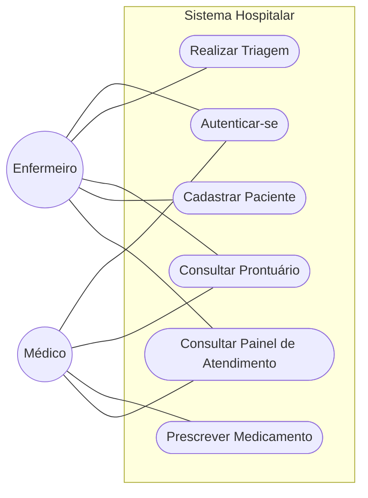
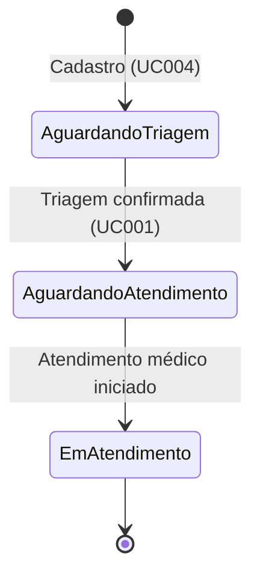

# Modelagem de Casos de Uso

## 1. Diagrama de Casos de Uso

## 2. Especificação dos Casos de Uso

### UC001 - Triagem
* **Ator**: Enfermeiro.
* **Fluxo**: Selecionar paciente -> Inserir Sinais Vitais -> Calcular Manchester -> Confirmar Triagem.

**Critérios de Classificação (Protocolo de Manchester)** — avaliados em cascata, da mais grave para a mais leve; o primeiro critério satisfeito define a cor:

| Cor | Critério (qualquer um) | Tempo-meta |
| :--- | :--- | :--- |
| Vermelho | SpO2 < 90% OU FC > 150 bpm OU PAS < 80 mmHg OU Dor ≥ 9 | Imediato |
| Laranja | SpO2 < 94% OU FC > 120 bpm OU Temp ≥ 39,5°C OU Dor ≥ 7 | Até 10 min |
| Amarelo | SpO2 < 96% OU FC > 100 bpm OU Temp ≥ 38°C OU Dor ≥ 4 | Até 60 min |
| Verde | Dor ≥ 1 OU FC > 90 bpm | Até 120 min |
| Azul | Nenhum critério acima (sinais vitais normais) | Até 240 min |

#### [CARE-UC001] Implementação da Triagem
* **Context**: Paciente identificado e autenticado.
* **Action**: Implementar lógica de cálculo do Protocolo de Manchester baseada em Sinais Vitais, conforme tabela de critérios acima.
* **Result**: Classificação de risco persistida e enviada para o painel médico.
* **Evaluation**: Teste unitário deve validar 5 cenários de cores (Vermelho a Azul) com 100% de acurácia.

### UC002 - Consultar Prontuário
* **Ator**: Enfermeiro, Médico.
* **Fluxo**: Selecionar paciente -> Visualizar sinais vitais da triagem, linha do tempo de evolução e prescrições.

#### [CARE-UC002] Implementação da Consulta de Prontuário
* **Context**: Paciente com pelo menos um registro (cadastro, triagem ou atendimento).
* **Action**: Buscar paciente por ID e compor view com sinais vitais mais recentes, evoluções em ordem cronológica decrescente e prescrições.
* **Result**: Tela somente-leitura; ação "+ Nova Prescrição" visível apenas para perfil Médico.
* **Evaluation**: Teste deve validar que paciente sem prescrições exibe "Nenhuma prescrição registrada." sem quebra de layout.

### UC003 - Prescrever Medicamento
* **Ator**: Médico.
* **Fluxo**: Selecionar paciente -> Preencher Medicamento, Dosagem, Via, Frequência, Observações -> Salvar Prescrição.

#### [CARE-UC003] Implementação da Prescrição
* **Context**: Usuário autenticado com perfil Médico; paciente selecionado.
* **Action**: Validar campos obrigatórios (medicamento, dosagem) e persistir prescrição vinculada ao paciente e ao médico responsável.
* **Result**: Prescrição adicionada ao prontuário; evolução clínica tipo "Prescrição" criada automaticamente; usuário retorna à tela de Prontuário.
* **Evaluation**: Teste deve rejeitar submissão sem medicamento/dosagem preenchidos.

### UC004 - Cadastrar Paciente
* **Ator**: Enfermeiro.
* **Fluxo**: Preencher Nome, CPF, CNS, Data de Nascimento, Sexo, Telefone -> Cadastrar Paciente.
* Detalhamento CARE: ver `[CARE-RF002]` em `02-requisitos.md`.

### UC005 - Autenticar-se
* **Ator**: Enfermeiro, Médico.
* **Fluxo**: Informar Matrícula e PIN -> Selecionar perfil (demonstração) -> Entrar.
* Detalhamento CARE: ver `[CARE-RF001]` em `02-requisitos.md`.

### UC006 - Consultar Painel de Atendimento
* **Ator**: Enfermeiro, Médico.
* **Fluxo**: Acessar Painel -> Filtrar por classificação de risco (opcional) -> Selecionar paciente para Triagem/Prontuário/Prescrição.
* Detalhamento CARE: ver `[CARE-RF006]` em `02-requisitos.md`.

## 3. Fluxo de Status do Paciente

