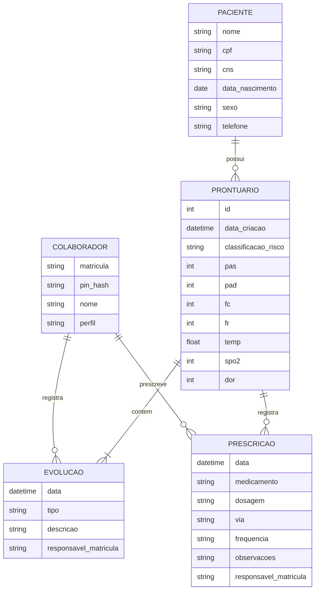

# Modelo de Dados e Dicionário

## 1. Modelo Entidade-Relacionamento


## 2. Dicionário de Dados
* Tabelas: PACIENTES, PRONTUARIOS, EVOLUCOES, PRESCRICOES, COLABORADORES.

### [SCHEMA] Esquema JSON - Paciente
```json
{
  "$schema": "http://json-schema.org/draft-07/schema#",
  "title": "Paciente",
  "type": "object",
  "properties": {
    "nome": { "type": "string", "minLength": 3 },
    "cpf": { "type": "string", "pattern": "^[0-9]{11}$" },
    "cns": { "type": "string", "pattern": "^[0-9]{15}$" },
    "data_nascimento": { "type": "string", "format": "date" }
  },
  "required": ["nome", "cpf", "cns", "data_nascimento"]
}
```

### [SCHEMA] Esquema JSON - Colaborador
```json
{
  "$schema": "http://json-schema.org/draft-07/schema#",
  "title": "Colaborador",
  "type": "object",
  "properties": {
    "matricula": { "type": "string", "pattern": "^[0-9]{6}$" },
    "pin_hash": { "type": "string" },
    "nome": { "type": "string", "minLength": 3 },
    "perfil": { "type": "string", "enum": ["enfermeiro", "medico"] }
  },
  "required": ["matricula", "pin_hash", "nome", "perfil"]
}
```

### [SCHEMA] Esquema JSON - Prescrição
```json
{
  "$schema": "http://json-schema.org/draft-07/schema#",
  "title": "Prescricao",
  "type": "object",
  "properties": {
    "medicamento": { "type": "string", "minLength": 1 },
    "dosagem": { "type": "string", "minLength": 1 },
    "via": { "type": "string", "enum": ["Oral", "IV", "IM", "SC", "Tópica"] },
    "frequencia": { "type": "string" },
    "observacoes": { "type": "string" },
    "responsavel_matricula": { "type": "string", "pattern": "^[0-9]{6}$" }
  },
  "required": ["medicamento", "dosagem", "via", "responsavel_matricula"]
}
```

## 3. Regras de Integridade
* Logs obrigatórios e proibição de exclusão física (soft delete).
* PIN armazenado somente como hash (nunca texto puro).
* `classificacao_risco` restrito ao enum `vermelho | laranja | amarelo | verde | azul`, conforme critérios do UC001 (`03-casos-uso.md`).
* `responsavel_matricula` é chave estrangeira obrigatória para `COLABORADOR.matricula`.
