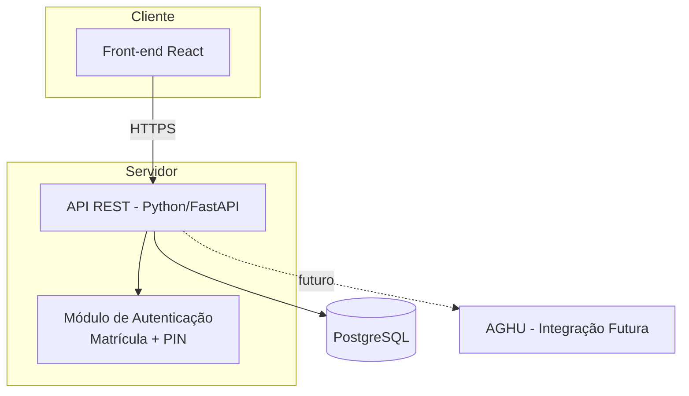

# Arquitetura e Segurança

## 1. Stack Técnica
* **Front-end**: React (componentes funcionais, hooks) — protótipo de referência em `docs/prototipo/projeto/`.
* **Back-end**: Python (FastAPI recomendado) — API REST conforme `05-interfaces.md`.
* **Banco de Dados**: PostgreSQL — schema conforme `04-modelo-dados.md`.
* **Autenticação**: matrícula + PIN (hash bcrypt/argon2), token JWT (ver RF001 em `02-requisitos.md`).

### Diagrama de Componentes

## 2. Conformidade LGPD
* Anonimização de dados em ambientes de teste/homologação.
* Gestão de consentimento via Termo de Consentimento Livre e Esclarecido (TCLE) no cadastro do paciente.
* Criptografia AES-256 para dados sensíveis em repouso (RNF001).
* Trilha de auditoria imutável para acesso a dados sensíveis (RNF002).

## 3. Acessos
* **RBAC**: perfis Enfermeiro e Médico com permissões distintas (ex: apenas Médico pode prescrever — ver RF005).
* **MFA**: não implementado nesta fase (autenticação simplificada por matrícula + PIN — ver decisão em RF001); reavaliar para produção.
* Sessão expira por inatividade (parâmetro a definir na implementação).

## 4. Guardrails para IA (SDD)
Para manter a integridade sistêmica, os assistentes de IA devem aderir às seguintes restrições:

### Escopo Positivo (O que fazer)
- **Documentação de Código**: Comentar funções complexas seguindo o padrão JSDoc/TSDoc.
- **Tratamento de Erros**: Utilizar blocos try-catch com logs de erro padronizados.
- **Testes**: Criar um arquivo de teste `.spec.ts` para cada novo controller ou service.

### Escopo Negativo (O que NÃO fazer - Anti-Patterns)
- **No Hard Deletes**: Proibido o uso de `DELETE` SQL. Utilizar coluna `deleted_at`.
- **No Secrets in Code**: Proibido salvar chaves de API ou senhas no código; utilizar `.env`.
- **No Refactoring Unasked**: Não alterar arquivos de infraestrutura ou configuração global sem instrução explícita no `SPEC.md`.
